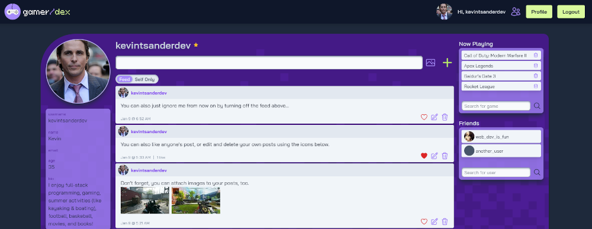

# Gamer-dex

Gamer-dex is a Facebook clone designed to link gamers together. This project was developed as the final project in the Ruby on Rails full stack curriculum from The Odin Project.

## Versions

This application was developed with Ruby 3.1.2 and Rails 7.0.4.

## Features

The following features have been implemented on this project:

- User sign up (using Devise authentication)
- User Omniauth login (Twitter - I deleted my Facebook account!)
- User can upload avatar (hosted by Azure Files)
- User can modify bio
- User can search for friends from their own user page
- User can make posts, which can contain text and/or images (hosted by Azure files)
- Attached images are validated by type, size, and quantity
- When on own page, user can view feed (own + friend posts) or their own posts only
- User feed implements hidden paging with infinite scroll
- User can request friends, accept a pending friendship request, or remove friends
- User can like (or unlike already liked) posts
- New users receive automated emails
- User can add games to their account with help from the [GiantBomb]('https://www.giantbomb.com)
- User can create, update, and delete posts, search for friends, or add games, all from their own user page

Read below for more details on the different ideas that make up this project:

## Friendships

Modeling friendships as a bi-directional relationship was an interesting problem. In the relationship table, we must have two fields to store user ids and the user we are interested in could be in either field.

This could be achieved easily with duplicate records with both user ids swapping columns, or by querying multiple times, but I wanted to try to optimize and avoid the overhead.
The easiest method would be to double the records for each relationship with the user ids swapped, but I wanted to avoid this overhead, and implemented the method outlined in [this stackoverflow post](https://stackoverflow.com/questions/37244283/how-to-model-a-mutual-friendship-in-rails/61904089#61904089), which uses clever querying to build working Active Record relationships regardless of which column the user is in.

## News Feed, Pagination & Union Queries

One goal of this project was to have a post feed, which would show a users' own posts as well as those of their friends in a "news feed". With built in Active Record queries, it would be easiest to first load the User's posts and then the friends posts separately, before merging them.

However, an interesting problem presents itself when paging data. We only want to return the most recent X posts (offset by the page #). If we do this transformation after querying and merging the data we will be querying for more data than we need. The solution is to use a UNION query to join the current users' post with that of all their friends. UNIONs are not built into Rails by default, so I installed the [active_record_union gem](https://github.com/brianhempel/active_record_union).

## Devise and Omniauth (and Turbo!)

Getting Devise working with Omniauth was a bit tricky. I wanted to use Twitter because I already have an account and I've already deleted my Facebook account. I used [this guide](https://web-crunch.com/posts/sign-in-with-twitter-using-devise-omniauth-ruby-on-rails) to help set it up. Turbo also presents some problems and requires special customizations to get working properly with Devise. Additionally, I had to figure out how to allow Omniauth users to update their profile without requiring a password (since we don't know it!) to make changes.

## Turbo Frames and Turbo Stream

This project makes extensive use of Hotwire Turbo Frames and Turbo Stream to limit page loads and provide a snappy user experience. Users can create, edit, delete posts, friends, and games all inline and without leaving their own page. Friends lists and statuses across the page will update in real time as changes are made elsewhere.

## Games from GiantBomb.com

I wanted users to be able to add their favorite games to their profile, with future plans to link users together by the games they are playing. However, just allowing users to enter games as free text would make the process of matching users together more difficult. COD:MW2, Call of Duty: Modern Warfare II, and Modern Warfare 2 all refer to the same game, but with entirely different ways of expressing it.

For this task I relied on the [GiantBomb.com](https://www.giantbomb.com) API to provide the search functionality and list of games. Aside from providing me with fancy box art to use for my search, this allowed me to store records for the same game, even if users search for them in different ways. Because I don't want to call the API too much as there are limits from Giant Bomb and for page load speed, I store the game name and UID locally, and don't display the external images outside of the search screen.

## Tailwind CSS

I took this project as an opportunity to use Tailwind CSS. I am very impressed by its power and the speed in which I can quickly make style changes without leaving the HTML. However, I'm still figuring out where it makes sense to bundle CSS classes together into their own custom components, as I found myself re-using similar styles in multiple places. It will be easy to make a change in one location and forget about another location.

## Image Storage

Images uploads are stored to an Azure Files account.

## Automated Emails

Automated emails are sent via Action Mailer. Initially I inteded to use Mailgun, but discovered that the free tier only allowed sending to verified accounts. Since I would love for anyone to log in and check out my work, I switched to an Gmail account instead.

## Image Previews

Image previews were added to for avatars and post images using a shared Hotwire Stimulus controller.

## Query Optimization

I found during this project that when cramming a lot of different data (user relationships, posts, etc) into a SPA, it is easy to spawn a lot of queries. It is crucial to reduce N+1 queries.

I also had several places where I needed to check the existence of an object (does the `current_user` have friends?) before getting data from it (displaying the friend list). `user.friends.exists?` runs a lightweight query to check if the record exists, and a separate query must be run to retrieve the friends, thus generating 2 queries for any user who has friends (which is hopefully everyone!). To reduce this traffic, I switched from `user.friends.exists?` to `user.friends.present?` to load the full dataset before checking existence. Of course the query is less lightweight, but it saves us a roundtrip by caching the data for reuse elsewhere on the page.

I suspect that #exists? would be more useful if the underlying data either did not need to be displayed, or if it was to be loaded in a separate asynchronous request.

There are other opportunities for further optimizations by further breaking down sections and components into more Turbo Frames operating in parallel.

## Infinite Post Scroll

I am using Turbo Streams and pagination with the Pagy gem to load new post pages as the user scrolls down.

## Attachment Previews

The default HTML file picker does not show image previews, so I created a Stimulus controller which will add the image previews using Javascript.
When editing a post, Rails will replace the old attachments and add the new attachment (or none if no selection made); A better UX would allow the user to keep or selectively delete the existing attachments, but that was out of scope for this project.

## Feed vs Self Navigation

The navigation between Feed vs Self Only posts is located within a Turbo Frame, and originally didn't update the page navigation with the `feed` parameter when it was changed within the Turbo Frame. This caused refreshes to be frustrating as the toggle would reset. I found [this Github PR](https://github.com/hotwired/turbo/pull/398) that allows adding `data-turbo-action="replace"` to links to update the browser history state to resolve this problem.

## Environment Variables & Secrets

Secrets are stored in environment variables using the figaro gem and are not to be uploaded to source control.
Versions

This application was developed with Ruby 3.1.2 and Rails 7.0.4.

## Features

The following features have been implemented on this project:

- User sign up (using Devise authentication)
- User Omniauth login (Twitter - I deleted my Facebook account!)
- User can upload avatar (hosted by Azure Files)
- User can modify bio
- User can search for friends from their own user page
- User can make posts, which can contain text and/or images (hosted by Azure files)
- Attached images are validated by type, size, and quantity
- When on own page, user can view feed (own + friend posts) or their own posts only
- User feed implements hidden paging with infinite scroll
- User can request friends, accept a pending friendship request, or remove friends
- User can like (or unlike already liked) posts
- New users receive automated emails
- User can add games to their account with help from the [GiantBomb]('https://www.giantbomb.com)
- User can create, update, and delete posts, search for friends, or add games, all from their own user page

Read below for more details on the different ideas that make up this project:

## Friendships

Modeling friendships as a bi-directional relationship was an interesting problem. In the relationship table, we must have two fields to store user ids and the user we are interested in could be in either field.

This could be achieved easily with duplicate records with both user ids swapping columns, or by querying multiple times, but I wanted to try to optimize and avoid the overhead.
The easiest method would be to double the records for each relationship with the user ids swapped, but I wanted to avoid this overhead, and implemented the method outlined in [this stackoverflow post](https://stackoverflow.com/questions/37244283/how-to-model-a-mutual-friendship-in-rails/61904089#61904089), which uses clever querying to build working Active Record relationships regardless of which column the user is in.

## News Feed, Pagination & Union Queries

One goal of this project was to have a post feed, which would show a users' own posts as well as those of their friends in a "news feed". With built in Active Record queries, it would be easiest to first load the User's posts and then the friends posts separately, before merging them.

However, an interesting problem presents itself when paging data. We only want to return the most recent X posts (offset by the page #). If we do this transformation after querying and merging the data we will be querying for more data than we need. The solution is to use a UNION query to join the current users' post with that of all their friends. UNIONs are not built into Rails by default, so I installed the [active_record_union gem](https://github.com/brianhempel/active_record_union).

## Devise and Omniauth (and Turbo!)

Getting Devise working with Omniauth was a bit tricky. I wanted to use Twitter because I already have an account and I've already deleted my Facebook account. I used [this guide](https://web-crunch.com/posts/sign-in-with-twitter-using-devise-omniauth-ruby-on-rails) to help set it up. Turbo also presents some problems and requires special customizations to get working properly with Devise. Additionally, I had to figure out how to allow Omniauth users to update their profile without requiring a password (since we don't know it!) to make changes.

## Turbo Frames and Turbo Stream

This project makes extensive use of Hotwire Turbo Frames and Turbo Stream to limit page loads and provide a snappy user experience. Users can create, edit, delete posts, friends, and games all inline and without leaving their own page. Friends lists and statuses across the page will update in real time as changes are made elsewhere.

## Games from GiantBomb.com

I wanted users to be able to add their favorite games to their profile, with future plans to link users together by the games they are playing. However, just allowing users to enter games as free text would make the process of matching users together more difficult. COD:MW2, Call of Duty: Modern Warfare II, and Modern Warfare 2 all refer to the same game, but with entirely different ways of expressing it.

For this task I relied on the [GiantBomb.com](https://www.giantbomb.com) API to provide the search functionality and list of games. Aside from providing me with fancy box art to use for my search, this allowed me to store records for the same game, even if users search for them in different ways. Because I don't want to call the API too much as there are limits from Giant Bomb and for page load speed, I store the game name and UID locally, and don't display the external images outside of the search screen.

## Tailwind CSS

I took this project as an opportunity to use Tailwind CSS. I am very impressed by its power and the speed in which I can quickly make style changes without leaving the HTML. However, I'm still figuring out where it makes sense to bundle CSS classes together into their own custom components, as I found myself re-using similar styles in multiple places. It will be easy to make a change in one location and forget about another location.

## Image Storage

Images uploads are stored to an Azure Files account.

## Automated Emails

Automated emails are sent via Action Mailer. Initially I inteded to use Mailgun, but discovered that the free tier only allowed sending to verified accounts. Since I would love for anyone to log in and check out my work, I switched to an Gmail account instead.

## Image Previews

Image previews were added to for avatars and post images using a shared Hotwire Stimulus controller.

## Query Optimization

I found during this project that when cramming a lot of different data (user relationships, posts, etc) into a SPA, it is easy to spawn a lot of queries. It is crucial to reduce N+1 queries.

I also had several places where I needed to check the existence of an object (does the `current_user` have friends?) before getting data from it (displaying the friend list). `user.friends.exists?` runs a lightweight query to check if the record exists, and a separate query must be run to retrieve the friends, thus generating 2 queries for any user who has friends (which is hopefully everyone!). To reduce this traffic, I switched from `user.friends.exists?` to `user.friends.present?` to load the full dataset before checking existence. Of course the query is less lightweight, but it saves us a roundtrip by caching the data for reuse elsewhere on the page.

I suspect that #exists? would be more useful if the underlying data either did not need to be displayed, or if it was to be loaded in a separate asynchronous request.

There are other opportunities for further optimizations by further breaking down sections and components into more Turbo Frames operating in parallel.

## Infinite Post Scroll

I am using Turbo Streams and pagination with the Pagy gem to load new post pages as the user scrolls down.

## Attachment Previews

The default HTML file picker does not show image previews, so I created a Stimulus controller which will add the image previews using Javascript.
When editing a post, Rails will replace the old attachments and add the new attachment (or none if no selection made); A better UX would allow the user to keep or selectively delete the existing attachments, but that was out of scope for this project.

## Feed vs Self Navigation

The navigation between Feed vs Self Only posts is located within a Turbo Frame, and originally didn't update the page navigation with the `feed` parameter when it was changed within the Turbo Frame. This caused refreshes to be frustrating as the toggle would reset. I found [this Github PR](https://github.com/hotwired/turbo/pull/398) that allows adding `data-turbo-action="replace"` to links to update the browser history state to resolve this problem.

## Environment Variables & Secrets

Secrets are stored in environment variables using the figaro gem and are not to be uploaded to source control.

## Unit Testing

Unfortunately, I had not yet learned how to create integration tests in Rails until I was far along in the project. I created some sample tests to ensure I understood the functionality, and plan to implement more tests as this app is refactored, but I did not aim for full coverage as some code would have to be refactored to improve testability. New projects will have tests coverage from the beginning.
